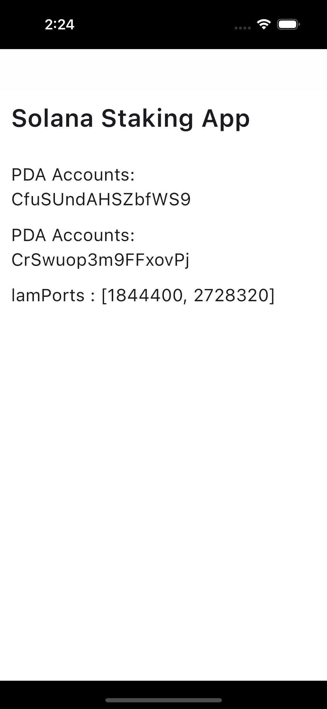

# Solana Dapp With Flutter

## Introduction
This program implements a staking system using the Solana blockchain. It allows users to stake tokens and claim rewards based on the staking duration and selected tiers. The program includes functionality for creating and updating a staking vault, staking tokens, claiming rewards, and unstaking tokens.

---

## Table of Contents
1. [Program ID](#program-id)  
2. [Constants](#constants)  
3. [Accounts](#accounts)  
4. [Instructions](#instructions)  
   - [create_stake_vault](#1-create_stake_vault)  
   - [update_stake_vault](#2-update_stake_vault)  
   - [stake_token](#3-stake_token)  
   - [claim_token](#4-claim_token)  
   - [unstake_token](#5-unstake_token)  
5. [Errors](#errors)

---

## Program ID
The program is identified by a unique Program ID on Solana, which is:  

declare_id!("EVMg71B51FabXrJCNWSM4vLjAV5fwVzPzPrqG2hXEZYy");

This ID is used to interact with the program on the Solana blockchain.

---

## Constants

### Stake Vault PDA Seed  
The `STAKE_PDA_SEED` is a unique identifier used to derive the program-derived address (PDA) for the staking vault. This ensures that the same address is used every time.

---

## Accounts

### VaultAccount
- Stores information about the staking vault, such as the total tokens available for rewards, the minimum and maximum staking amounts, and the status of staking (paused or active).

### StakeAccount
- Stores individual user stake information, such as the amount of tokens staked, the timestamp of when staking started, and the staking tier.

### Token Accounts
- Includes token-related accounts, such as the user's token account (to send tokens from) and the vault's token account (to receive tokens).

### Signer
- The user who interacts with the program and signs the transactions.

---

## Instructions

### 1. create_stake_vault
**Purpose:**  
Initializes the staking vault. Callable only by the admin of the program.

**Parameters:**  
- `_bump`: PDA bump seed.  
- `total_token_amount`: Total token amount available for rewards.  
- `min_token`: Minimum amount of tokens required to stake.  
- `max_token`: Maximum amount of tokens allowed to stake.  
- `pause_staking`: A boolean flag to pause/unpause staking.

**Workflow:**  
1. Verifies admin privileges.  
2. Initializes vault variables like the total amount, min/max staking limits, and staking status.

---

### 2. update_stake_vault
**Purpose:**  
Allows the admin to modify the staking vault's parameters, including token amounts and the pause flag.

**Parameters:**  
- `_bump`: PDA bump seed.  
- `total_token_amount`: Updated total token amount.  
- `min_token`: Updated minimum staking amount.  
- `max_token`: Updated maximum staking amount.  
- `pause_staking`: Flag to pause or unpause staking.

**Workflow:**  
1. Verifies admin privileges.  
2. Updates the vault’s token amount, min/max staking amounts, and pause status.

---

### 3. stake_token
**Purpose:**  
Allows users to stake their tokens.

**Parameters:**  
- `_bump`: PDA bump seed.  
- `amount`: Amount of tokens to stake.  
- `stake_tier`: Selected staking tier (e.g., 30, 90, 180 days).

**Workflow:**  
1. Checks if staking is paused.  
2. Validates staking amount against min/max limits.  
3. Transfers tokens to the vault.  
4. Records staking details in the user's StakeAccount.

---

### 4. claim_token
**Purpose:**  
Allows users to claim staking rewards.

**Workflow:**  
1. Checks for an active stake.  
2. Calculates rewards based on staking tier and duration.  
3. Transfers rewards from the vault to the user's account.  
4. Updates StakeAccount with the new timestamp.

---

### 5. unstake_token
**Purpose:**  
Allows users to unstake tokens and withdraw them, along with earned rewards.

**Workflow:**  
1. Verifies an active stake.  
2. Ensures the lockup period has passed.  
3. Calculates the reward.  
4. Transfers staked amount and rewards to the user's account.  
5. Marks the stake as inactive.

---

## Errors

### InvalidSuperOwner
Occurs when a non-admin attempts admin-only operations.

### PauseStaking
Returned if staking is paused.

### AlreadyStaked
Occurs when a user tries to stake while already having an active stake.

### InvalidMinAmount
Triggered if the staking amount is less than the minimum limit.

### InvalidMaxAmount
Triggered if the staking amount exceeds the maximum limit.

### AlreadyUnStaked
Occurs if the user attempts to claim or unstake when they have already unstaked.

---

## Example Flutter Template
For integrating with this program, following Flutter template is used as a base:  
[Flutter Solana Wallet Integration Template]([https://github.com/solana-dev/solana-flutter-template](https://github.com/saifuzzafar/flutter_template_v1)

